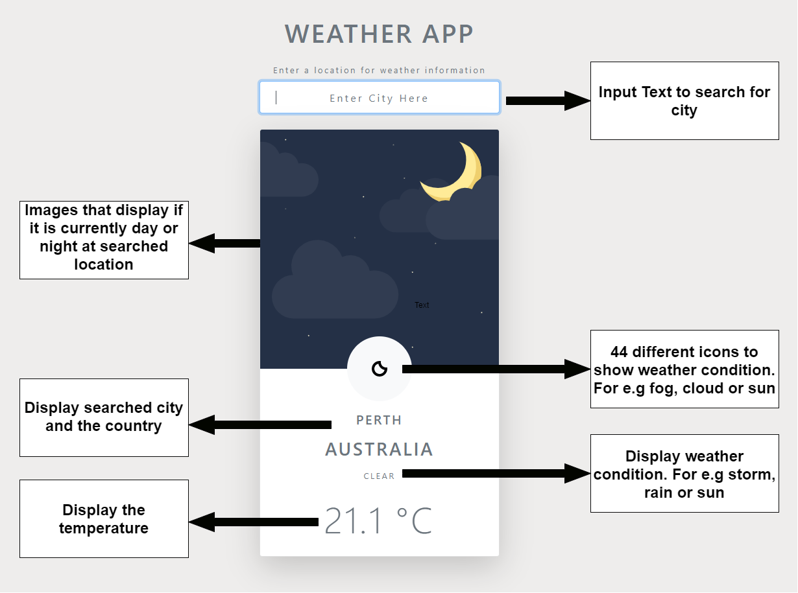

# WEATHER APP

This app was developed using _HTML_, _CSS_, _BOOTSTRAP_ and _VANILLA JAVASCRIPT_

#### App not working? 

For the app to work, register  yourself on the website below and get your API Key, then add your key in the **scripts > forecast.js** and  paste your key in the **const key**.

#### Web API used

The web api used for this app is [accuweather](https://developer.accuweather.com/)

#### App features

